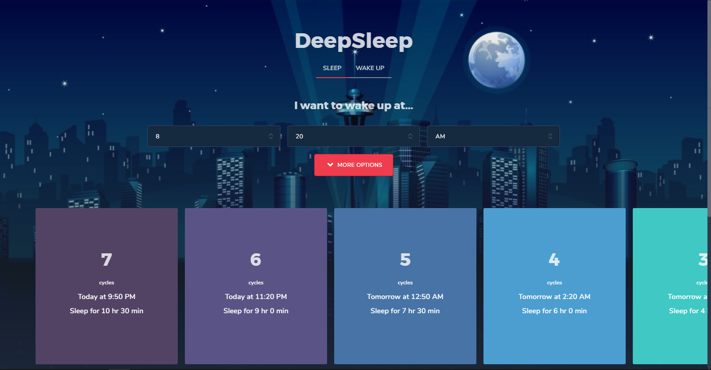

<h1 align="center">Project DeepSleep</h1>
<p align="center">Better sleep times with React.</p>

## How to Run
First update the app styles if any changes were made.
```
gulp
```
Now, run on `localhost:3000`.
```
npm start
```
For a production build, run
```
yarn build
```

## What is it?
Project DeepSleep is designed to be a sleep calculator powered by React. With this, sleep times are calculated and rendered much faster. Enter when you would like to wake up and DeepSleep calculates sleep cycle times on when would be the best times to sleep to wake up feeling energized. It also tells you when to wake up if you decide to sleep at the current time.
[Demo](https://spiderpig86.github.io/DeepSleep/build/)

## Built With
* :rocket: [React](https://github.com/facebook/react) - a library for stateful components
* :cloud: [Cirrus](https://github.com/Spiderpig86/Cirrus) - a CSS framework I'm building
* :watch: [moment.js](https://github.com/moment/moment) - a library for timer conversions

## Screenshots
